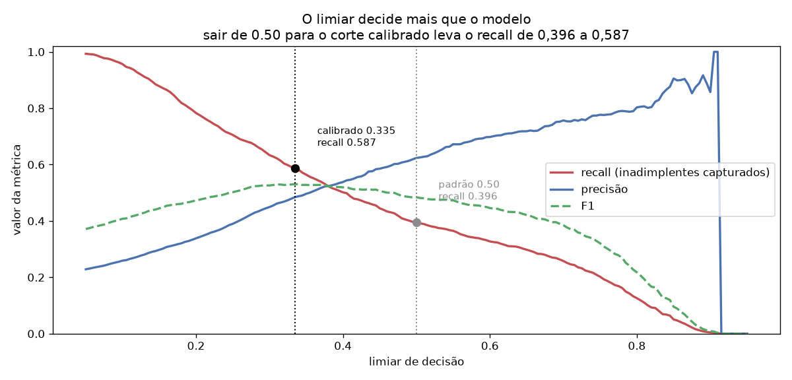
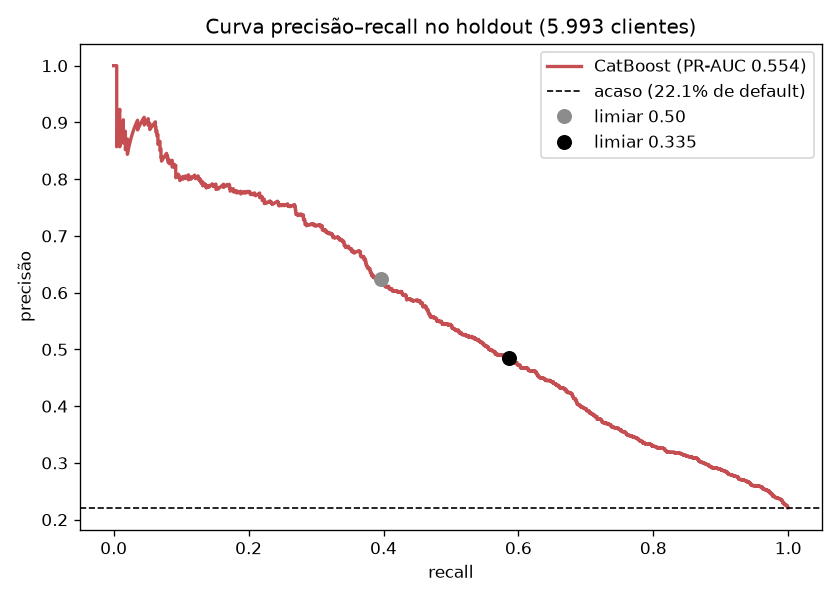

# Credit Risk Scoring System

Sistema **ponta a ponta** de **avaliação de risco de crédito** sobre **dados
reais**: estima a probabilidade de inadimplência de clientes de cartão — de
dados a score servido em API, com explicabilidade por SHAP, limiar de decisão
calibrado, dashboard e containerização. Projeto de portfólio para **Cientista de
Dados Pleno**, com foco em rigor sob classe desbalanceada e em **decisão de
crédito**, não só em métrica.


## Dados

**[Default of Credit Card Clients](https://archive.ics.uci.edu/dataset/350/default+of+credit+card+clients)**
(Yeh & Lien, 2009) — UCI Machine Learning Repository. **30.000 clientes de cartão
de crédito de Taiwan**, com o histórico de pagamento de abril a setembro de 2005
e o desfecho de inadimplência no mês seguinte. Baixado automaticamente pelo
pipeline (`src/data/download.py`); `data/` não é versionado.

Após a limpeza: **29.965 clientes, 22,13% de inadimplência**.

## Contexto de negócio

Conceder e manter crédito é decidir sob incerteza com **erros assimétricos**:
não identificar quem vai inadimplir vira perda direta do principal; barrar um bom
pagador vira receita perdida e cliente na concorrência. O trabalho do modelo não
é "acertar mais" — é **ordenar risco bem o suficiente** para que a política de
crédito possa cortar onde o negócio quiser cortar. Por isso a saída é uma
**probabilidade** mais uma **faixa de risco** (BAIXO / MÉDIO / ALTO) ancorada num
limiar explícito, que a área de crédito traduz em aprovar, revisar limite ou
suspender. Público-alvo: bancos e fintechs de cartão.

## O trabalho que dado real exige

Esta é a parte que uma base sintética nunca cobra. O arquivo do UCI **contradiz a
própria documentação em três pontos**, e cada um exigiu uma decisão:

| Problema encontrado | Registros | Decisão |
|---|---:|---|
| `education` com os códigos **0, 5 e 6** (doc define só 1–4) | 345 | Colapsados em `4` (outros) |
| `marriage` com o código **0** (doc define 1–3) | 54 | Colapsado em `3` (outros) |
| Linhas **duplicadas exatas** | 35 | Removidas |
| `bill_amt*` **negativo** | 590 | **Mantidos** — é saldo a favor, não erro |
| `pay_*` com os códigos **-2 e 0**, não documentados | ~17.500 | **Mantidos** — ver abaixo |

### O achado que definiu a feature engineering

A documentação descreve `pay_*` como `-1 = pago em dia` e `1..9 = meses de
atraso`. Os códigos `-2` e `0` existem no arquivo e não são explicados. Medindo a
inadimplência de cada um:

| Código | Leitura | Clientes | Default |
|---|---|---:|---:|
| `-2` | sem consumo no mês | 2.750 | 13,2% |
| `-1` | pagou a fatura inteira | 5.682 | **16,8%** |
| `0` | crédito rotativo (pagou o mínimo) | 14.737 | **12,8%** |
| `1` | 1 mês de atraso | 3.667 | 34,0% |
| `2` | 2 meses de atraso | 2.666 | 69,1% |

**A relação não é monótona**: quem quita a fatura toda (`-1`) inadimple *mais* do
que quem rola no rotativo (`0`). Tratar essa coluna como um inteiro numa escala
linear ensinaria ao modelo uma ordem que **não existe no dado**.

A solução foi **contar regimes** em vez de usar o número cru — e as contagens são
bem-comportadas:

- `meses_em_atraso`: **11,7%** de default com zero atrasos → **70,3%** com seis.
  É a feature mais correlacionada com o alvo (0,398).
- `meses_rotativo` e `meses_sem_consumo`: separam os dois regimes negativos, que
  a escala numérica confundia.

Detalhes e gráficos em [`notebooks/01-eda.ipynb`](notebooks/01-eda.ipynb).

## Stack
Python 3.12 · Pandas/NumPy · scikit-learn · XGBoost · CatBoost ·
imbalanced-learn (SMOTE) · SHAP · MLflow · FastAPI · Streamlit ·
SQLAlchemy/PostgreSQL · Docker · pytest

## Arquitetura
```
 UCI (download) ─▶ ETL ─▶ PostgreSQL / parquet
   (30.000 clientes)  │  (limpeza dos códigos       │
                      │   fora da documentação)     ▼
          Feature Engineering ─▶ Split estratificado
          (utilização do limite,     │
           taxa de pagamento,        │   SMOTE ─▶ XGBoost · CatBoost
           contagens de regime,      │   (dentro do ImbPipeline:
           tendência da dívida)      │    só reamostra no fit)
                                     │        └─▶ MLflow
                                     ▼
              melhor modelo por PR-AUC ─▶ limiar calibrado por F1
                                     │  └─▶ SHAP (explicabilidade)
                ┌────────────────────┴────────────────────┐
                ▼                                          ▼
          API FastAPI  ◀── /predict ──   Dashboard Streamlit
     (/health /predict)                  (KPIs · EDA · simulador)
```

## Resultados

Holdout estratificado de 20% (5.993 clientes). Métrica de seleção: **PR-AUC**,
acompanhada do **KS** — a estatística que a indústria de crédito usa. Acurácia é
ignorada: aprovar todo mundo já "acerta" 77,9%.

| Modelo | ROC-AUC | PR-AUC | KS |
|---|---:|---:|---:|
| **CatBoost** ✅ | **0.773** | **0.554** | **0.419** |
| XGBoost | 0.768 | 0.545 | 0.399 |

**Estes números são modestos de propósito — e é assim que deve ser.** Um ROC-AUC
de ~0,77 está alinhado com a literatura publicada para este dataset. O teto é do
problema: prever inadimplência a partir de seis meses de histórico é difícil, e
qualquer número muito acima disso, nesta base, indicaria vazamento.

### O limiar importa mais que o modelo

A escolha entre CatBoost e XGBoost move o PR-AUC em 0,009. A escolha do **limiar
de decisão** move o recall em **19 pontos**:

| Limiar | Recall | Precisão | F1 |
|---|---:|---:|---:|
| 0.50 (padrão) | 0.396 | 0.624 | 0.484 |
| **0.335 (calibrado)** | **0.587** | 0.485 | **0.531** |





No corte padrão de 0.5 o modelo captura **menos de 40%** dos inadimplentes — para
uma área de crédito, isso é o modelo falhando na sua função. Calibrando o limiar
por F1, a captura sobe para **58,7%**, ao custo de a precisão cair de 62% para
48,5%.

Por isso o limiar **é calibrado no treino e persistido junto do modelo**: a API
carrega o bundle `{pipeline, threshold}` e devolve qual limiar usou. Em produção
o critério seria o custo real do negócio (perda de um default vs. margem perdida
numa recusa); o F1 é o substituto neutro enquanto esses números não estão na mesa.

### Explicabilidade

O SHAP ([`reports/shap_summary.png`](reports/shap_summary.png)) confirma o que a
EDA mostrou: **comportamento recente de pagamento domina** e cadastro quase não
importa — `age` correlaciona 0,014 com o alvo. Em crédito, explicabilidade não é
estética: é **exigência regulatória**, é preciso justificar a negativa.

Duas variáveis aparecem como **protetoras**, ambas contraintuitivas:
`meses_rotativo` (−0,154) e `limit_bal` (−0,154). Limite alto reduz o risco
porque é *consequência* de um bom histórico — o banco já concedeu confiança
àquele cliente. É uma variável **endógena**, e num sistema em produção usá-la para
decidir crédito realimenta a política que a gerou. Fica registrado como risco de
modelagem, não como insight.

## Decisões de projeto

- **SMOTE dentro do `Pipeline` do imbalanced-learn**, nunca antes do split. Só
  reamostra no `fit`; no teste e na inferência é ignorado. Aplicar SMOTE no
  dataset inteiro é o erro clássico que infla toda métrica.
- **Contagens de regime no lugar de `pay_*` cru**, pelo motivo medido acima.
- **Limiar calibrado e versionado com o modelo**, para a API não voltar ao 0.5
  implícito.
- **Faixas de risco ancoradas no limiar** (BAIXO < limiar/2 ≤ MÉDIO < limiar ≤
  ALTO): se o limiar for recalibrado, as faixas acompanham.
- **Pipeline inteiro serializado** (pré-processador + modelo), então a mesma
  transformação vale no treino e na API — sem divergência treino/inferência.
- **Testes sem rede**: a suíte monta um DataFrame no esquema do UCI em vez de
  baixar o dataset, então o CI é rápido e determinístico.

## Como executar

### Local (venv)
```bash
python -m venv .venv && source .venv/bin/activate
pip install -r requirements.txt

python -m src.data.download    # 1) baixa o dataset do UCI (~5 MB, uma vez)
python -m src.data.etl         # 2) limpa e persiste
python -m src.models.train     # 3) treina, compara e calibra o limiar
python -m src.models.explain   # 4) gera o SHAP

uvicorn app.main:app --reload              # API em http://localhost:8000/docs
streamlit run app/dashboard.py             # dashboard em http://localhost:8501
pytest -q                                  # 32 testes
```

### Docker
```bash
docker compose up --build    # sobe Postgres + API (8000) + dashboard (8501)
```
> Treine o modelo antes (`python -m src.models.train`) para gerar `models/model.joblib`.

## Exemplo de uso da API

```bash
curl -X POST http://localhost:8000/predict -H "Content-Type: application/json" -d '{
  "limit_bal": 200000, "sex": 2, "education": 2, "marriage": 1, "age": 35,
  "pay_1": 0, "pay_2": 0, "pay_3": 0, "pay_4": 0, "pay_5": 0, "pay_6": 0,
  "bill_amt1": 50000, "bill_amt2": 48000, "bill_amt3": 46000,
  "bill_amt4": 44000, "bill_amt5": 42000, "bill_amt6": 40000,
  "pay_amt1": 3000, "pay_amt2": 3000, "pay_amt3": 3000,
  "pay_amt4": 3000, "pay_amt5": 3000, "pay_amt6": 3000
}'
# → {"default_probability": 0.0983, "risk_band": "BAIXO",
#    "will_default": false, "threshold": 0.335}
```

Um cliente com seis meses de atraso e limite estourado, nos mesmos moldes,
retorna `0.8492` / `ALTO`. O cliente da chamada acima está no rotativo com 25% do
limite usado — e, coerente com o achado da EDA, alguém que **quita** a fatura todo
mês pontua `0.1537`, *acima* dele.

`GET /health` informa o status e se o modelo foi carregado; sem `model.joblib` a
API responde **503 com mensagem acionável** em vez de um erro genérico.

## Estrutura
```
src/
  data/       download.py (UCI) · etl.py (limpeza do dado real)
  features/   build_features.py
  models/     train.py (+ calibração de limiar) · explain.py
  config.py
app/          main.py (FastAPI) · dashboard.py (Streamlit)
tests/        conftest.py + 4 arquivos · 32 testes, sem acesso a rede
notebooks/    01-eda.ipynb (executado, com gráficos)
reports/      ARQUITETURA.md · RELATORIO_TECNICO.md · metrics.json · shap_summary.png
```

## Melhorias futuras

- **Trocar o F1 por uma função de custo real** na calibração do limiar — o ganho
  prático mais imediato, já que a escolha do corte pesa mais que a do modelo.
- **Tratar a endogeneidade de `limit_bal`**, avaliando o modelo sem ela para
  medir quanto do desempenho vem da política de crédito já existente.
- **Monitoramento de drift** e recalibração periódica do limiar.
- Otimização de hiperparâmetros (Optuna) e **calibração de probabilidades**
  (Platt/isotônica) — importante quando a probabilidade vira preço de juros.

---
Projeto **02** do portfólio de Data Science Pleno.
