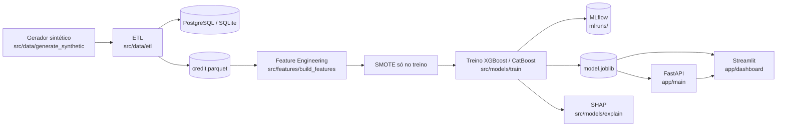
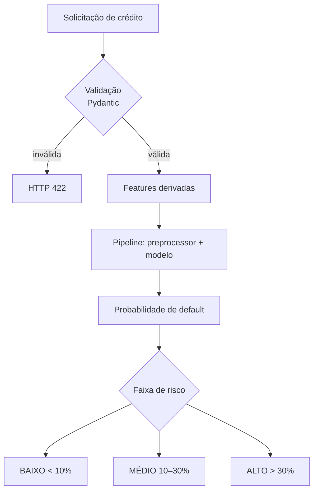

# Arquitetura — Credit Risk Scoring System

## Diagrama de arquitetura

## Fluxograma da predição

## Componentes

| Camada | Arquivo | Responsabilidade |
|---|---|---|
| Dados | `src/data/generate_synthetic.py` | Gera base sintética desbalanceada |
| ETL | `src/data/etl.py` | Extrai, valida e carrega no banco + parquet |
| Config | `src/config.py` | Paths e `DATABASE_URL` (fallback SQLite) |
| Features | `src/features/build_features.py` | Features derivadas + ColumnTransformer |
| Treino | `src/models/train.py` | SMOTE + XGBoost/CatBoost + MLflow |
| Interpretação | `src/models/explain.py` | SHAP summary |
| API | `app/main.py` | `/health`, `/predict` |
| Dashboard | `app/dashboard.py` | KPIs, EDA, simulador |
| Deploy | `Dockerfile`, `docker-compose.yml` | API + Postgres + dashboard |
