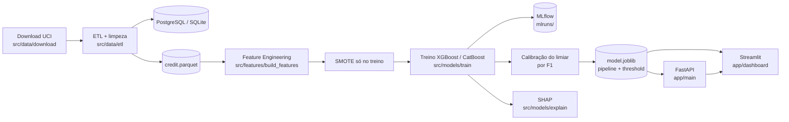
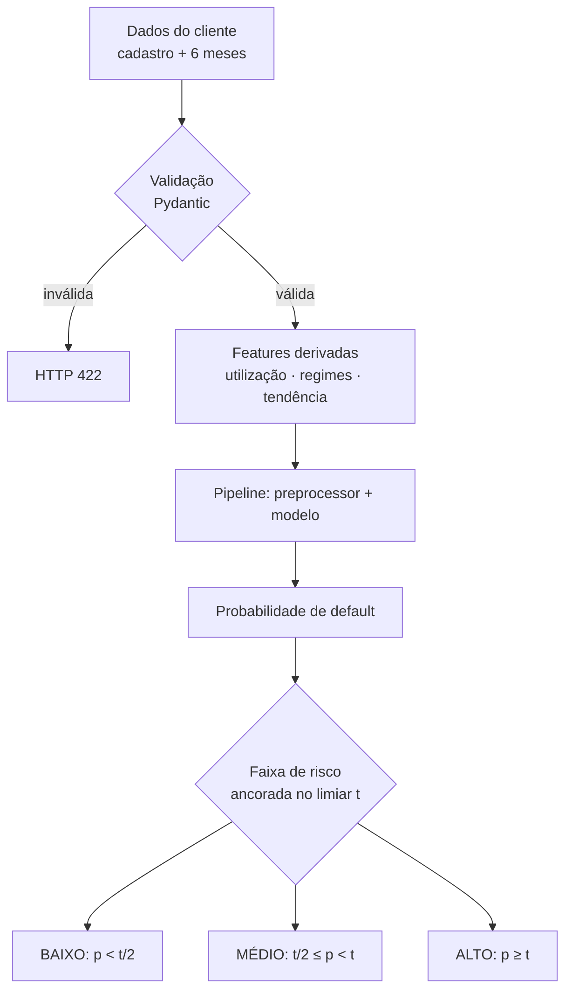

# Arquitetura — Credit Risk Scoring System

## Diagrama de arquitetura

## Fluxograma da predição

O limiar `t` não é fixo em 0.5: é calibrado no treino, salvo junto do modelo e
devolvido na resposta da API. Ver o README para o impacto dessa escolha.

## Componentes

| Camada | Arquivo | Responsabilidade |
|---|---|---|
| Dados | `src/data/download.py` | Baixa e cacheia o dataset real do UCI |
| ETL | `src/data/etl.py` | Limpa os códigos fora da documentação, deduplica, carrega |
| Config | `src/config.py` | Paths, URL do dataset e `DATABASE_URL` (fallback SQLite) |
| Features | `src/features/build_features.py` | Derivadas de crédito + ColumnTransformer |
| Treino | `src/models/train.py` | SMOTE + XGBoost/CatBoost + calibração de limiar + MLflow |
| Interpretação | `src/models/explain.py` | SHAP summary |
| API | `app/main.py` | `/health`, `/predict` |
| Dashboard | `app/dashboard.py` | KPIs, EDA, simulador |
| Deploy | `Dockerfile`, `docker-compose.yml` | API + Postgres + dashboard |
